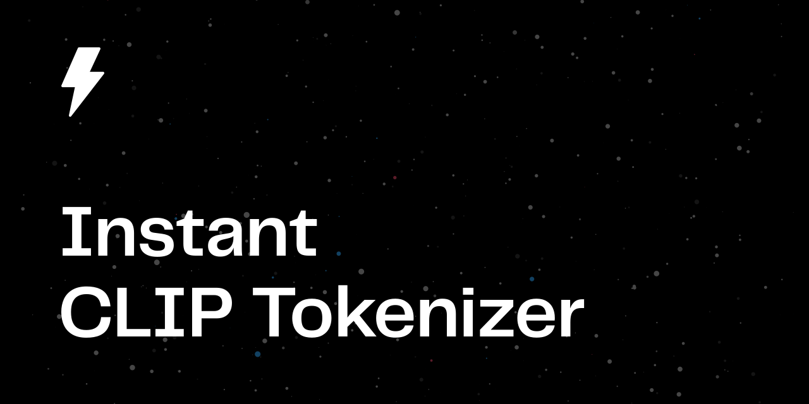

# Instant CLIP Tokenizer: a fast tokenizer for the CLIP neural network

[](https://docs.rs/instant-clip-tokenizer/)
[](https://crates.io/crates/instant-clip-tokenizer)
[](https://pypi.org/project/instant-clip-tokenizer/)
[](https://github.com/instant-labs/instant-clip-tokenizer/actions?query=workflow%3ACI)
[](LICENSE-MIT)

Instant CLIP Tokenizer is a fast pure-Rust text tokenizer for [OpenAI's CLIP model](https://github.com/openai/CLIP). It is intended to be a replacement for the original Python-based tokenizer included in the CLIP repository, aiming for 100% compatibility with the original implementation. It can also be used with [OpenCLIP](https://github.com/mlfoundations/open_clip) and other implementations using the same tokenizer.

In addition to being usable as a Rust crate it also includes Python bindings built with [PyO3](https://pyo3.rs/) so that it can be used as a native Python module.

For the microbenchmarks included in this repository, Instant CLIP Tokenizer is ~70x faster than the Python implementation (with preprocessing and caching disabled to ensure a fair comparison).

## Using the library

### Rust

```toml
[dependencies]
instant-clip-tokenizer = "0.1.0"
# To enable additional functionality that depends on the `ndarray` crate:
# instant-clip-tokenizer = { version = "0.1.0", features = ["ndarray"] }
```

### Python **(>= 3.9)**

```sh
pip install instant-clip-tokenizer
```

Using the library requires `numpy >= 1.16.0` installed in your Python environment (e.g., via `pip install numpy`).

### Examples

```rust
use instant_clip_tokenizer::{Token, Tokenizer};

let tokenizer = Tokenizer::new();

let mut tokens = Vec::new();
tokenizer.encode("A person riding a motorcycle", &mut tokens);
let tokens = tokens.into_iter().map(Token::to_u16).collect::<Vec<_>>();
println!("{:?}", tokens);

// -> [320, 2533, 6765, 320, 10297]
```

```python
import instant_clip_tokenizer

tokenizer = instant_clip_tokenizer.Tokenizer()

tokens = tokenizer.encode("A person riding a motorcycle")
print(tokens)

# -> [320, 2533, 6765, 320, 10297]

batch = tokenizer.tokenize_batch(["A person riding a motorcycle", "Hi there"], context_length=5)
print(batch)

# -> [[49406   320  2533  6765 49407]
#     [49406  1883   997 49407     0]]
```

## Testing

To run the tests run the following:

```sh
cargo test --all-features
```

You can also test the Python bindings with:

```sh
make test-python
```

## Acknowledgements

The vocabulary file and original Python tokenizer code included in this repository are copyright (c) 2021 OpenAI ([MIT-License](https://github.com/openai/CLIP/blob/main/LICENSE)).
